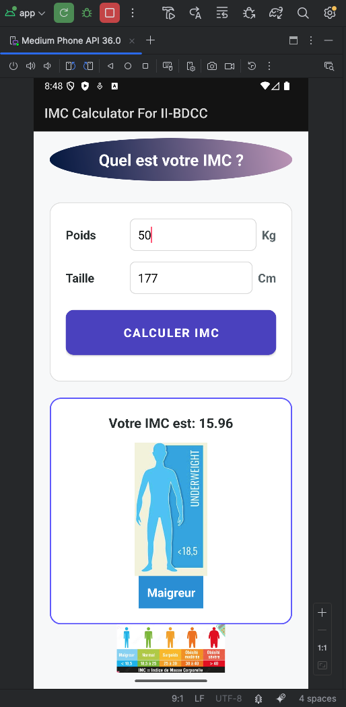
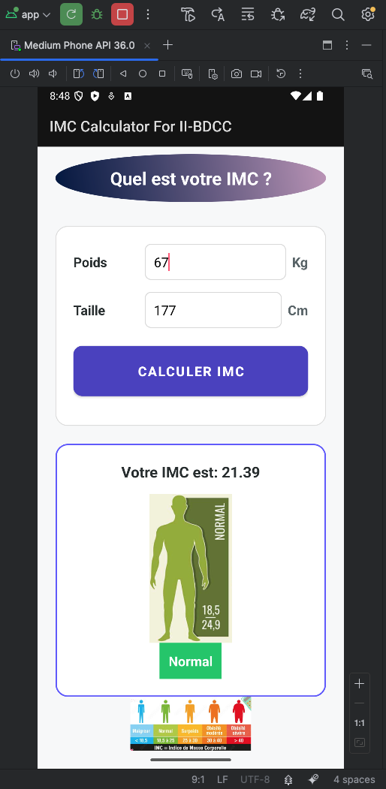
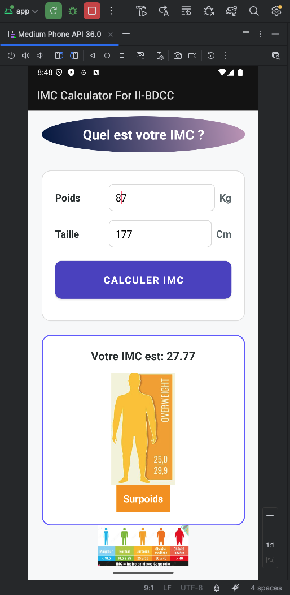
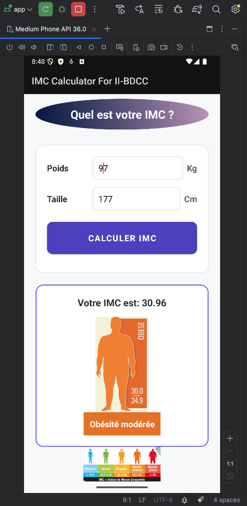
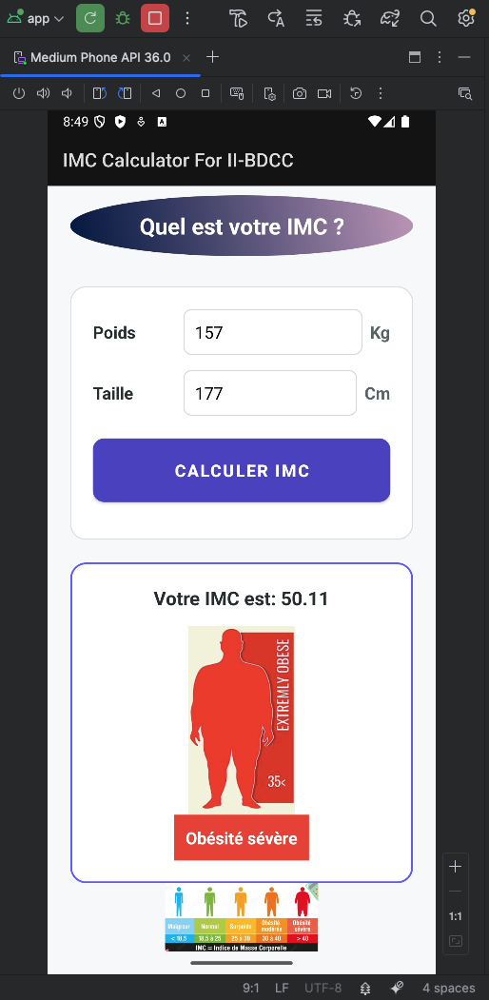

# Android Natif IMC Calculator
Créer une application mobile Android qui permet de :
- Saisir le poids et la taille d’une personne
- Afficher son indice de Masse Corporelle
-  Affiche l’image adéquat à sa catégorie de masse corporelle suivante :

